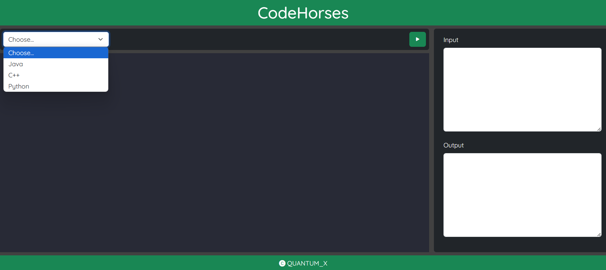
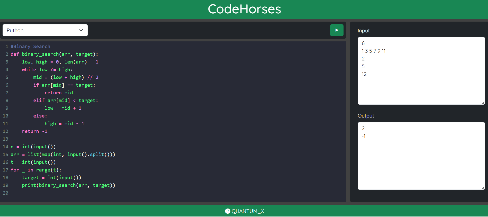
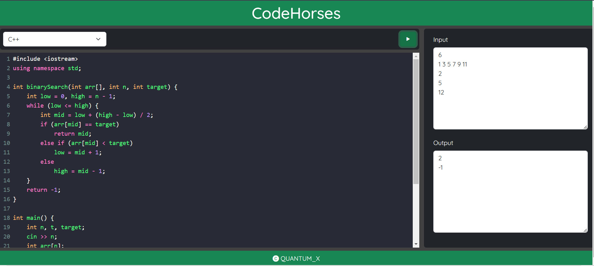
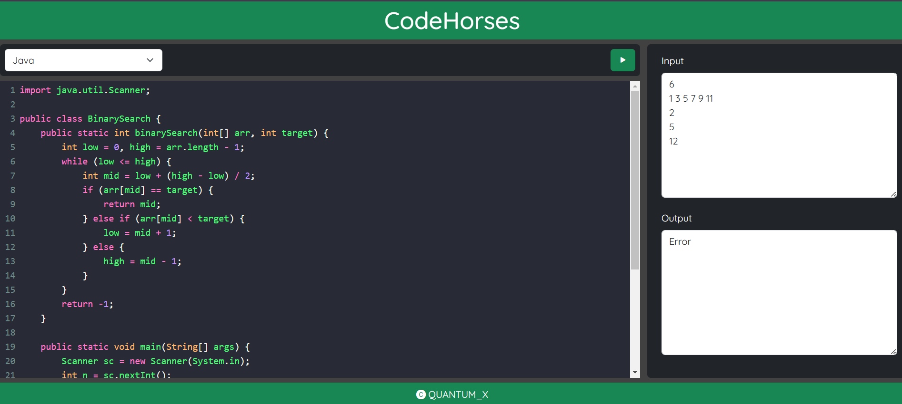

# Web-Based Code Editor and Compiler

This project is a web-based code editor and compiler, built using CodeMirror for code editing and CompileX for code compilation.

## Features

### Real-Time Code Editing
- Utilizes CodeMirror to provide an interactive, syntax-highlighted code editor.
- Supports multiple programming languages.

### Code Compilation
- Integrates CompileX for compiling and executing code on the server side.
- Supports real-time compilation of code written in C, C++, Java, Python, and more.

### User-Friendly Interface
- Clean and minimalistic design for ease of use.
- Responsive layout suitable for both desktop and mobile devices.

## Installation

### Prerequisites
- Node.js
- npm (Node Package Manager)

### Steps

1. **Clone the Repository:**

    ```bash
    git clone https://github.com/govinddwivedi-git/CodeHorses
    ```

2. **Install Dependencies:**

    ```bash
    npm install
    ```

3. **Start the Server:**

    ```bash
    Nodemon Api.js
    ```

4. **Open in Browser:**

    Navigate to `http://localhost:8000` in your web browser.

## Project Screenshots

|  |  |
|---|---|
| Sign Up Form | Login Form |

|  |  |
|---|---|
| Dashboard | Analysis of Codeforces |


## Usage

- Open the editor in your browser.
- Select the programming language from the dropdown.
- Write your code in the editor.
- Use the buttons to run your code.
- View the output in the designated output area.

## Contributing

Contributions are welcome! Please fork the repository and submit a pull request.

## License

This project is licensed under the MIT License.